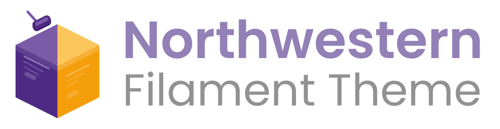

<p align="center">
    
</p>

<p align="center">
    <a href="https://www.php.net"></a>
    <a href="https://laravel.com"></a>
    <a href="https://filamentphp.com"></a>
</p>

<hr/>

<p align="center">
    A branded <a href="https://filamentphp.com">Filament</a> theme plugin for <a href="https://www.northwestern.edu">Northwestern University</a> applications. Applies the official NU color palette, typography, and institutional styling to any Filament panel.
</p>

<p align="center">
    
</p>

## Installation

```bash
composer require northwestern-sysdev/northwestern-filament-theme
```

## Quick Start

Register the plugin in your Filament panel provider:

```php
use Northwestern\FilamentTheme\NorthwesternTheme;

public function panel(Panel $panel): Panel
{
    return $panel
        ->plugins([
            NorthwesternTheme::make(),
            // ... other plugins
        ])
        // ... rest of panel config
    ;
}
```

Then publish the theme assets:

```bash
php artisan filament:assets
```

> [!NOTE]
>
> If your panel has a [custom theme](https://filamentphp.com/docs/5.x/styling/overview#creating-a-custom-theme) via `->viteTheme()`, it will continue to work alongside this plugin. The Northwestern theme is an **additive CSS layer** registered separately through Filament's asset system. It does not replace your custom theme.

## Vite Theme Integration

You can also import the theme directly into your panel's Vite-compiled stylesheet instead of loading it as a separate `<link>` tag. This gives you a single compiled CSS bundle, access to Northwestern design tokens as Tailwind v4 utility classes (e.g., `bg-nu-purple-100`, `text-nu-gold`), and the ability to override specific theme styles in your own CSS.

### Setup

Run the install command:

```bash
php artisan northwestern-theme:install
```

This will:
- Create a panel theme CSS file if one doesn't exist
- Inject the Northwestern theme `@import` after the Filament base import
- Optionally inject Tailwind v4 design tokens for color utilities

Then disable automatic asset registration in your panel provider to prevent the CSS from loading twice:

```php
NorthwesternTheme::make()
    ->withoutAssetRegistration()
```

Finally, compile your assets:

```bash
npm run build
```

### Tailwind v4 Design Tokens

When you opt in to design tokens during `northwestern-theme:install`, the plugin provides Northwestern colors as Tailwind v4 utility classes:

```html
<div class="bg-nu-purple-100 text-white">Purple background</div>
<span class="text-nu-gold">Gold accent text</span>
<div class="border border-nu-black-20">Subtle border</div>
```

Available token groups:

| Group             | Examples                                                                   |
|-------------------|----------------------------------------------------------------------------|
| Purple scale      | `nu-purple-10` through `nu-purple-160`                                     |
| Grays             | `nu-black-10`, `nu-black-20`, `nu-black-50`, `nu-black-80`, `nu-black-100` |
| Brand colors      | `nu-green`, `nu-teal`, `nu-blue`, `nu-yellow`, `nu-gold`, `nu-orange`      |
| Dark brand colors | `nu-dark-green`, `nu-dark-teal`, `nu-dark-blue`, etc.                      |
| Semantic colors   | `nu-success`, `nu-info`, `nu-warning`, `nu-danger`                         |

> [!NOTE]
>
> Design tokens require **Tailwind CSS v4+** (they use the `@theme` syntax). The core theme CSS works with any Tailwind version.

## Dark Mode

The theme adapts to Filament's dark mode setting automatically. No extra configuration needed.

## Favicon & Brand Logo

The plugin automatically sets a Northwestern favicon and brand logo when the panel has not already configured them. If you call `->favicon()` or `->brandLogo()` on your panel, your values take precedence.

The brand logo is resolved in the following order:

1. Panel-level `->brandLogo()` (if set, the plugin does not override it)
2. `config('northwestern-theme.lockup')` (from [`northwestern-sysdev/northwestern-laravel-ui`](https://github.com/NIT-Administrative-Systems/northwestern-laravel-ui), if installed)
3. The default Northwestern wordmark SVG from the Northwestern CDN

If your application uses [`northwestern-sysdev/northwestern-laravel-ui`](https://github.com/NIT-Administrative-Systems/northwestern-laravel-ui), the `northwestern-theme.lockup` config value is already published for you. The Filament theme plugin reads it automatically.

## Environment Indicator

The theme includes a built-in environment indicator that displays a gold badge in the topbar and a colored top-border on non-production environments. This is enabled by default.

The indicator automatically hides in production and on small screens.

### Disabling the Indicator

```php
NorthwesternTheme::make()
    ->withoutEnvironmentIndicator()
```

### Custom Visibility

To control when the indicator appears (e.g., only for admins):

```php
NorthwesternTheme::make()
    ->environmentIndicator(
        visible: fn () => ! app()->isProduction() && auth()->user()?->hasRole('admin'),
    )
```

### Custom Label

By default, the badge reads "Environment: Local" (or whatever `APP_ENV` is set to). To customize:

```php
NorthwesternTheme::make()
    ->environmentIndicator(label: Str::upper(App::environment()))
```

> [!NOTE]
>
> If you are using [`pxlrbt/filament-environment-indicator`](https://github.com/pxlrbt/filament-environment-indicator), you can remove that package. Remove `EnvironmentIndicatorPlugin::make()` from your panel provider and the theme handles the rest.

## Footer

The footer is disabled by default. Your application may have multiple Filament panels, some internal where a footer would just be noise, others end-user-facing where institutional branding matters. You opt in per panel by chaining `->footer()`:

```php
NorthwesternTheme::make()
    ->footer()
```

This renders Northwestern branding, legal links, office contact info, and social media links.

### Office Information

Office contact details displayed in the footer are resolved in the following order:

1. Values passed directly to `->footer()` (see below)
2. `config('northwestern-theme.office.*')` values (from `northwestern-sysdev/northwestern-laravel-ui`, if installed)
3. Hardcoded IT defaults (Information Technology, 1800 Sherman Ave, etc.)

If your application already has [`northwestern-sysdev/northwestern-laravel-ui`](https://github.com/NIT-Administrative-Systems/northwestern-laravel-ui) installed, the footer will pick up `office.name`, `office.addr`, `office.city`, `office.phone`, and `office.email` automatically.

To override specific fields:

```php
NorthwesternTheme::make()
    ->footer(
        officeName: 'My Office',
        officeAddr: '633 Clark St',
        officeCity: 'Evanston, IL 60208',
        officePhone: '847-555-1234',
        officeEmail: 'my-office@northwestern.edu',
    )
```

### Disabling the Footer

Pass `enabled: false` or a closure that returns a boolean:

```php
NorthwesternTheme::make()
    ->footer(enabled: false)

NorthwesternTheme::make()
    ->footer(enabled: fn () => auth()->user()?->isStudent())
```

## Customizing Views

To modify the environment indicator or footer markup, publish the views:

```bash
php artisan vendor:publish --tag=northwestern-filament-theme-views
```

This publishes the following templates to `resources/views/vendor/northwestern-filament-theme/`:

- `environment-indicator.blade.php` — the topbar badge and border
- `footer.blade.php` — the institutional footer

## External CDN Dependency

This theme loads fonts, icons, the favicon, and the default brand logo from Northwestern's CDN (`common.northwestern.edu`). Your application needs network access to this CDN at runtime. If your environment restricts outbound requests or enforces a strict CSP, allowlist `https://common.northwestern.edu`.

## Upgrading

See [UPGRADING.md](UPGRADING.md) for migration guides between major versions.

## License

The MIT License (MIT). Please see [LICENSE](LICENSE) for more information.
