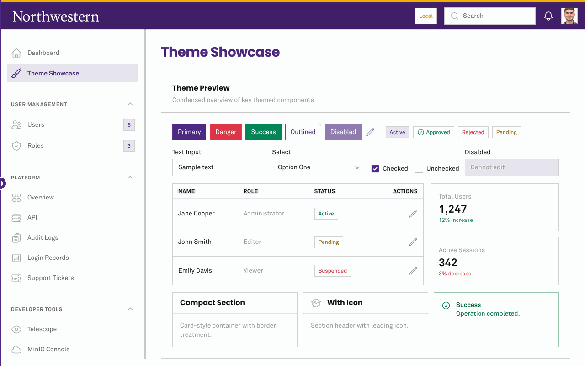

<div id="user-content-toc">
  <ul align="center" style="list-style: none;">
    <summary>
      <h1>Northwestern Filament Theme</h1>
    </summary>
  </ul>
</div>

<p align="center">
    
    
    
</p>

<hr/>

<p align="center">
    A branded <a href="https://filamentphp.com">Filament</a> theme plugin for <a href="https://www.northwestern.edu">Northwestern University</a> applications. Applies the official NU color palette, typography, and institutional styling to any Filament panel.
</p>

<p align="center">
    
</p>

## Installation

```bash
composer require northwestern-sysdev/northwestern-filament-theme
```

## Usage

Register the plugin in your Filament panel provider alongside your existing `viteTheme`:

```php
use Northwestern\FilamentTheme\NorthwesternTheme;

public function panel(Panel $panel): Panel
{
    return $panel
        ->plugins([
            NorthwesternTheme::make(),
            // ... other plugins
        ])
        ->viteTheme('resources/css/filament/administration/theme.css')
        // ... rest of panel config
    ;
}
```

Then publish the theme assets:

```bash
php artisan filament:assets
```

> [!IMPORTANT]
>
> The `->viteTheme()` call is still required. It provides the Tailwind build that generates Filament's utility classes. The Northwestern theme is an **additive CSS layer** on top of Tailwind, it does not replace it.

## Favicon & Brand Logo

The plugin automatically sets a Northwestern favicon and brand logo when the panel has not already configured them. If you call `->favicon()` or `->brandLogo()` on your panel, your values take precedence.

The brand logo is resolved in the following order:

1. Panel-level `->brandLogo()` (if set, the plugin does not override it)
2. `config('northwestern-theme.lockup')` (from [`northwestern-sysdev/northwestern-laravel-ui`](https://github.com/NIT-Administrative-Systems/northwestern-laravel-ui), if installed)
3. The default Northwestern wordmark SVG from the Northwestern CDN

If your application uses [`northwestern-sysdev/northwestern-laravel-ui`](https://github.com/NIT-Administrative-Systems/northwestern-laravel-ui), the `northwestern-theme.lockup` config value is already published for you. The Filament theme plugin reads it automatically, no additional configuration is needed.

## Footer

The footer is disabled by default. Your application may have multiple Filament panels — some internal and staff-facing where a footer would just be noise, others end-user-facing where institutional branding matters. You opt in to the footer on a per-panel basis by chaining `->footer()`:

```php
NorthwesternTheme::make()
    ->footer()
```

This renders the standard Northwestern branding, legal links, office contact information, and social media links.

### Office Information

Office contact details displayed in the footer are resolved in the following order:

1. Values passed directly to `->footer()` (see below)
2. `config('northwestern-theme.office.*')` values (from `northwestern-sysdev/northwestern-laravel-ui`, if installed)
3. Hardcoded IT defaults (Information Technology, 1800 Sherman Ave, etc.)

If your application already has [`northwestern-sysdev/northwestern-laravel-ui`](https://github.com/NIT-Administrative-Systems/northwestern-laravel-ui) installed and its config published, the footer will pick up `office.name`, `office.addr`, `office.city`, `office.phone`, and `office.email` automatically.

To override specific fields:

```php
NorthwesternTheme::make()
    ->footer(
        officeName: 'My Office',
        officeAddr: '633 Clark St',
        officeCity: 'Evanston, IL 60208',
        officePhone: '847-555-1234',
        officeEmail: 'my-office@northwestern.edu',
    )
```

### Disabling the Footer

Pass `enabled: false` or a closure that returns a boolean:

```php
NorthwesternTheme::make()
    ->footer(enabled: false)

NorthwesternTheme::make()
    ->footer(enabled: fn () => auth()->user()?->isStudent())
```

### Customizing the Footer View

To modify the footer markup, publish the views and edit the template:

```bash
php artisan vendor:publish --tag=northwestern-filament-theme-views
```

This publishes to `resources/views/vendor/northwestern-filament-theme/footer.blade.php`.

## License

The MIT License (MIT). Please see [LICENSE](LICENSE) for more information.
