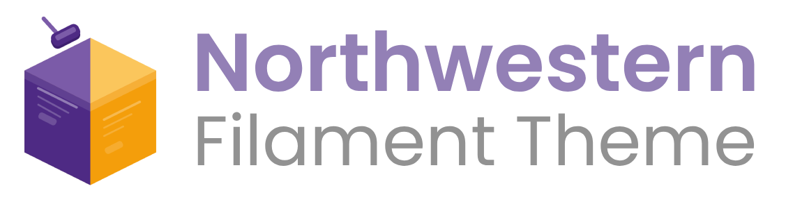
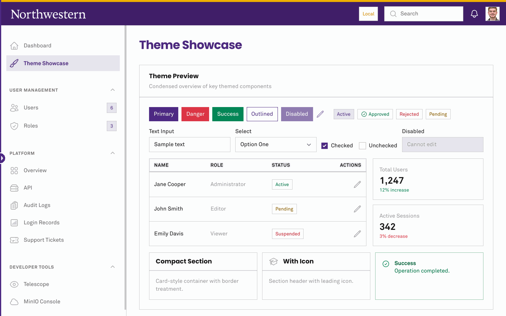

<p align="center">
    
</p>

<p align="center">
    <a href="https://www.php.net"></a>
    <a href="https://laravel.com"></a>
    <a href="https://filamentphp.com"></a>
</p>

<hr/>

<p align="center">
    A branded <a href="https://filamentphp.com">Filament</a> theme plugin for <a href="https://www.northwestern.edu">Northwestern University</a> applications. Applies the official NU color palette, typography, and institutional styling from <a href="https://common.northwestern.edu/dept/4.0/">Department Templates 4.0</a> to any Filament panel, and adds the required university footer.
</p>

<p align="center">
    
</p>

## Installation

```bash
composer require northwestern-sysdev/northwestern-filament-theme
```

## Quick Start

Register the plugin in your Filament panel provider:

```php
use Northwestern\FilamentTheme\NorthwesternTheme;

public function panel(Panel $panel): Panel
{
    return $panel
        ->plugins([
            NorthwesternTheme::make(),
            // ... other plugins
        ])
        // ... rest of panel config
    ;
}
```

Then publish the theme assets:

```bash
php artisan filament:assets
```

> [!NOTE]
>
> If your panel has a [custom theme](https://filamentphp.com/docs/5.x/styling/overview#creating-a-custom-theme) via `->viteTheme()`, it will continue to work alongside this plugin. The Northwestern theme is an **additive CSS layer** registered separately through Filament's asset system. It does not replace your custom theme.

## Configuration

The theme's branding content lives in `config/northwestern-filament-theme.php`: your unit's lockup, its contact details for the footer, the footer's Quick Links and its social accounts. Publish it to edit it:

```bash
php artisan vendor:publish --tag=northwestern-filament-theme-config
```

```php
return [
    // A unit lockup (URL or public path). null uses the dept 4.0 "Northwestern" wordmark.
    'lockup' => env('NU_LOCKUP'),

    // The unit responsible for the application, shown in the footer.
    'unit' => [
        'name' => env('NU_UNIT_NAME'),
        'address' => env('NU_UNIT_ADDRESS'),
        'city' => env('NU_UNIT_CITY'),
        'phone' => env('NU_UNIT_PHONE'),
        'fax' => env('NU_UNIT_FAX'),
        'email' => env('NU_UNIT_EMAIL'),
    ],

    'footer' => [
        // Shown under "Quick Links", as label => URL.
        'links' => [],

        // The "Connect" accounts, as network => URL. [] hides the section.
        'social' => [
            'facebook' => 'https://www.facebook.com/NorthwesternU',
            'instagram' => 'https://instagram.com/northwesternu',
            'youtube' => 'https://www.youtube.com/user/NorthwesternU',
        ],
    ],
];
```

Config describes your unit. Per-panel behavior stays on the plugin: turning the footer off, the environment indicator and the impersonation banner.

### Resolution Order

Each value resolves in this order:

1. A value passed to `->footer()` or to the footer component's props. These are deprecated; see [Deprecated Footer Arguments](#deprecated-footer-arguments).
2. `config('northwestern-filament-theme.*')`.
3. The legacy `config('northwestern-theme.*')` key, from [`northwestern-sysdev/northwestern-laravel-ui`](https://github.com/NIT-Administrative-Systems/northwestern-laravel-ui) if it is installed.
4. The built-in default: Information Technology's contact details, no fax, no Quick Links, Northwestern's social accounts and the dept 4.0 wordmark.

`null` means "not set" and moves on to the next step. An empty string hides the field, and for `lockup` it means the wordmark. So an app that still has `config/northwestern-theme.php` keeps working without changes, and anything you set in the new file wins over it.

### Moving From `northwestern-theme.php`

Apps built on starter v2 have a `config/northwestern-theme.php` published by `northwestern-laravel-ui`. The theme still reads it, so moving is optional in 4.x. To move, publish the new file and copy each value across:

| Legacy key (`northwestern-theme.`) | Legacy env var          | New key (`northwestern-filament-theme.`) | New env var       |
| ---------------------------------- | ----------------------- | ---------------------------------------- | ----------------- |
| `lockup`                           | `NU_THEME_LOCKUP`       | `lockup`                                 | `NU_LOCKUP`       |
| `office.name`                      | `NU_THEME_OFFICE_NAME`  | `unit.name`                              | `NU_UNIT_NAME`    |
| `office.addr`                      | `NU_THEME_OFFICE_ADDR`  | `unit.address`                           | `NU_UNIT_ADDRESS` |
| `office.city`                      | `NU_THEME_OFFICE_CITY`  | `unit.city`                              | `NU_UNIT_CITY`    |
| `office.phone`                     | `NU_THEME_OFFICE_PHONE` | `unit.phone`                             | `NU_UNIT_PHONE`   |
| `office.fax`                       | `NU_THEME_OFFICE_FAX`   | `unit.fax`                               | `NU_UNIT_FAX`     |
| `office.email`                     | `NU_THEME_OFFICE_EMAIL` | `unit.email`                             | `NU_UNIT_EMAIL`   |
| none (`->footer(links:)`)          | none                    | `footer.links`                           | none              |
| none (hardcoded)                   | none                    | `footer.social`                          | none              |

The legacy file's `sentry-dsn`, `sentry-enable-apm-js`, `sentry-traces-sample-rate` and `globalAlerts` keys belong to `northwestern-laravel-ui`, not to this theme, and have no equivalent here.

The legacy `lockup` default in `northwestern-laravel-ui` is the `v8` wordmark URL. Once the legacy file is gone, an unset `lockup` gives the dept 4.0 wordmark instead.

## Vite Theme Integration

You can also import the theme directly into your panel's Vite-compiled stylesheet instead of loading it as a separate `<link>` tag. This gives you a single compiled CSS bundle, access to Northwestern design tokens as Tailwind v4 utility classes (e.g., `bg-nu-purple-100`, `text-nu-gold`), and the ability to override specific theme styles in your own CSS.

### Setup

Run the install command:

```bash
php artisan northwestern-theme:install
```

This will:

- Create a panel theme CSS file if one doesn't exist
- Inject the Northwestern theme `@import` after the Filament base import
- Optionally inject Tailwind v4 design tokens for color utilities

Then disable automatic asset registration in your panel provider to prevent the CSS from loading twice:

```php
NorthwesternTheme::make()
    ->withoutAssetRegistration()
```

Finally, compile your assets:

```bash
npm run build
```

### Tailwind v4 Design Tokens

When you opt in to design tokens during `northwestern-theme:install`, the plugin provides Northwestern colors and fonts as Tailwind v4 utility classes:

```html
<div class="bg-nu-purple-100 text-white">Purple background</div>
<span class="text-nu-gold">Gold accent text</span>
<div class="border border-nu-black-20">Subtle border</div>
<h2 class="font-nu-display text-nu-purple-100">Serif heading</h2>
```

Available token groups:

| Group             | Examples                                                                                  |
| ----------------- | ----------------------------------------------------------------------------------------- |
| Purple scale      | `nu-purple-10` through `nu-purple-160`                                                    |
| Grays             | `nu-black-10`, `nu-black-20`, `nu-black-50`, `nu-black-80`, `nu-black-100`                |
| Brand colors      | `nu-green`, `nu-teal`, `nu-blue`, `nu-yellow`, `nu-gold`, `nu-orange`                     |
| Dark brand colors | `nu-dark-green`, `nu-dark-teal`, `nu-dark-blue`, etc.                                     |
| Semantic colors   | `nu-success`, `nu-info`, `nu-warning`, `nu-danger`                                        |
| Fonts             | `font-nu-body` (Akkurat Pro), `font-nu-heading` (Poppins), `font-nu-display` (Noto Serif) |

> [!NOTE]
>
> Design tokens require **Tailwind CSS v4+** (they use the `@theme` syntax). The core theme CSS works with any Tailwind version.

The palette, fonts and radius come from [`@nu-appdev/northwestern-tokens`](https://github.com/NIT-Administrative-Systems/northwestern-tokens), which this package bundles into `dist/` at build time. You don't install the npm package yourself.

### Tokens Without Filament

`dist/tokens.css` contains only the Northwestern `@font-face` rules and the `--nu-*` custom properties, with no Filament selectors. Use it on pages that render outside a panel, such as an error layout, together with the [footer component](#outside-a-panel). Inside a panel you don't need it: `dist/theme.css` already includes it.

## Dark Mode

The theme adapts to Filament's dark mode setting automatically. No extra configuration needed.

## Favicon & Brand Logo

The plugin automatically sets a Northwestern favicon and brand logo when the panel has not already configured them. If you call `->favicon()` or `->brandLogo()` on your panel, your values take precedence.

The brand logo is resolved in the following order:

1. Panel-level `->brandLogo()` (if set, the plugin does not override it)
2. The configured `lockup` (see [Configuration](#configuration)), passed through `asset()`
3. The Department Templates 4.0 "Northwestern" wordmark, as inline SVG. It is Northwestern Purple on light backgrounds and white in the topbar and in dark mode.

The default favicon is `https://common.northwestern.edu/favicon.ico`, the icon dept 4.0 pages use.

If your application uses [`northwestern-sysdev/northwestern-laravel-ui`](https://github.com/NIT-Administrative-Systems/northwestern-laravel-ui), its legacy `northwestern-theme.lockup` value still applies when the new `lockup` is unset. Its default is the `v8` wordmark URL, so set the legacy `lockup` to `null`, or move to the new config, to get the dept 4.0 wordmark.

## Environment Indicator

The theme includes a built-in environment indicator that displays a gold badge and a colored top border on non-production environments: in the topbar of full pages, and at the top of simple pages such as login. This is enabled by default.

The indicator automatically hides in production. The topbar badge also hides on small screens.

### Disabling the Indicator

```php
NorthwesternTheme::make()
    ->withoutEnvironmentIndicator()
```

### Custom Visibility

To control when the indicator appears (e.g., only for admins):

```php
NorthwesternTheme::make()
    ->environmentIndicator(
        visible: fn () => ! app()->isProduction() && auth()->user()?->hasRole('admin'),
    )
```

### Custom Label

By default, the badge reads "Environment: Local" (or whatever `APP_ENV` is set to). To customize:

```php
NorthwesternTheme::make()
    ->environmentIndicator(label: Str::upper(App::environment()))
```

> [!NOTE]
>
> If you are using [`pxlrbt/filament-environment-indicator`](https://github.com/pxlrbt/filament-environment-indicator), you can remove that package. Remove `EnvironmentIndicatorPlugin::make()` from your panel provider and the theme handles the rest.

## Impersonation Banner

The theme includes a built-in impersonation banner that renders a red bar above the topbar when a user is being impersonated. It is registered by default and shows automatically when [`lab404/laravel-impersonate`](https://github.com/404labfr/laravel-impersonate) is installed and an impersonation session is active. Without lab404, the banner will not appear unless you provide a custom `visible` closure.

### Custom Visibility

If you are not using [`lab404/laravel-impersonate`](https://github.com/404labfr/laravel-impersonate), or want to override the default detection, provide your own visibility logic:

```php
NorthwesternTheme::make()
    ->impersonationBanner(
        visible: fn () => session()->has('impersonating'),
    )
```

### Custom Label

```php
NorthwesternTheme::make()
    ->impersonationBanner(
        label: fn () => 'Acting as ' . auth()->user()->name,
    )
```

### Custom Leave URL

```php
NorthwesternTheme::make()
    ->impersonationBanner(
        leaveUrl: '/my-app/stop-impersonating',
    )
```

### Custom Leave Label

```php
NorthwesternTheme::make()
    ->impersonationBanner(
        leaveLabel: 'Return to Admin',
    )
```

### Custom Leave Method

The leave form defaults to `POST`. If your leave endpoint expects a different HTTP method:

```php
NorthwesternTheme::make()
    ->impersonationBanner(
        leaveUrl: '/my-app/stop-impersonating',
        leaveMethod: 'DELETE',
    )
```

### Disabling the Banner

```php
NorthwesternTheme::make()
    ->withoutImpersonationBanner()
```

> [!NOTE]
>
> If your application has a custom impersonation banner registered, remove it when enabling the built-in banner to avoid duplicates. A warning is logged in local environments when both are detected.

## Footer

Every panel gets the Northwestern footer, built to the Department Templates 4.0 structure:

- the "Northwestern University" wordmark, linked to northwestern.edu, and your unit's name
- your unit's address, phone, fax and email
- social accounts under "Connect", Northwestern's unless you configure your own
- your own links under "Quick Links", if you add any
- the links the university's Web Style Guide requires, which can't be removed: Building Access, Campus Emergency Information, Careers, Contact Northwestern University, University Policies, Accessibility, Disclaimer, Privacy Statement and Report a Concern

On full pages the footer renders after the layout, through Filament's `BODY_END` render hook, so it spans the window below the sidebar and the content. On simple pages such as login it renders inside the layout through `SIMPLE_LAYOUT_END`, below the card.

### Unit Information

The footer shows the `unit` details from [the config](#configuration). The Web Style Guide requires your unit's address, phone, fax (if you have one) and email. A field that resolves to an empty string is hidden. The fax is optional and has no default.

```dotenv
NU_UNIT_NAME="Research Computing"
NU_UNIT_ADDRESS="2020 Ridge Ave"
NU_UNIT_CITY="Evanston, IL 60208"
NU_UNIT_PHONE="847-555-1234"
NU_UNIT_EMAIL="research@northwestern.edu"
```

### Adding Links

Set `footer.links` as label => URL pairs. They render under "Quick Links", next to the required links:

```php
'footer' => [
    'links' => [
        'Help' => 'https://example.northwestern.edu/help',
        'Service Status' => 'https://status.example.northwestern.edu',
    ],
],
```

### Social Accounts

`footer.social` lists the accounts under "Connect", as network => URL, in display order. It defaults to Northwestern's Facebook, Instagram and YouTube accounts. Set it to `[]` to hide the section.

```php
'footer' => [
    'social' => [
        'linkedin' => 'https://www.linkedin.com/company/example-unit',
        'bluesky' => 'https://bsky.app/profile/example.northwestern.edu',
    ],
],
```

The networks are the ones Department Templates 4.0 has icons for: `bluesky`, `facebook`, `flickr`, `instagram`, `linkedin`, `pinterest`, `rss`, `spotify`, `threads`, `tiktok`, `tumblr`, `vimeo`, `wordpress`, `x` and `youtube`. Other keys are skipped.

### Deprecated Footer Arguments

`->footer()` still accepts `officeName`, `officeAddr`, `officeCity`, `officePhone`, `officeEmail`, `officeFax` and `links`, and they still take precedence over the config. They are deprecated and will be removed in a future major release. Use the config instead. `->footer(enabled:)` is not deprecated.

### Required Links

The required links live in the `Northwestern\FilamentTheme\Footer\RequiredLink` enum, so anything else that needs them, such as a text-only mail footer, reads the same list:

```php
use Northwestern\FilamentTheme\Footer\RequiredLink;

RequiredLink::Accessibility->url();   // https://www.northwestern.edu/accessibility/report/
RequiredLink::PrivacyStatement->label(); // Privacy Statement

RequiredLink::RESOURCES; // the five links under "Northwestern Resources"
RequiredLink::LEGAL;     // the four links in the bottom bar
```

### Outside a Panel

The `<x-northwestern-filament-theme::footer />` component renders the same footer without Filament, auth or the database, so it works on public pages and on error pages that render while the database is down. With no props it renders from the config:

```blade
<x-northwestern-filament-theme::footer />
```

Its `office-*` and `links` props mirror the deprecated `->footer()` arguments. They still work and are deprecated in the same way.

The footer inlines its own styles, which use the `--nu-*` custom properties and fonts. Inside a panel those come from the theme CSS; on a page without it, load `dist/tokens.css` as well (see [Tokens Without Filament](#tokens-without-filament)). The standalone footer is light only.

### Disabling the Footer

Pass `enabled: false` or a closure that returns a boolean:

```php
NorthwesternTheme::make()
    ->footer(enabled: false)

NorthwesternTheme::make()
    ->footer(enabled: fn () => auth()->user()?->isStudent())
```

## Customizing Views

To modify the environment indicator, impersonation banner, or footer markup, publish the views:

```bash
php artisan vendor:publish --tag=northwestern-filament-theme-views
```

This publishes the following templates to `resources/views/vendor/northwestern-filament-theme/`:

- `environment-indicator.blade.php` — the environment badge and border
- `impersonation-banner.blade.php` — the impersonation session banner
- `footer.blade.php` — the institutional footer
- `components/footer.blade.php` — the `<x-northwestern-filament-theme::footer />` component
- `social-icon.blade.php` — the "Connect" icons
- `wordmark.blade.php` — the inline dept 4.0 wordmarks

The required links are not in the published view's control: they come from the `RequiredLink` enum. A `footer.blade.php` published from 4.0 keeps working, but it hardcodes the social accounts and ignores `footer.links` from the config. Re-publish it to pick those up.

## External CDN Dependency

This theme loads fonts and the favicon from Northwestern's CDN (`common.northwestern.edu/dept/4.0/`). The wordmark and footer icons are inline SVG. Your application needs network access to this CDN at runtime. If your environment restricts outbound requests or enforces a strict CSP, allowlist `https://common.northwestern.edu`.

Akkurat Pro is licensed for central hosting by the university only, so the fonts always load from the CDN and are never bundled into this package.

## Upgrading

See [UPGRADING.md](UPGRADING.md) for migration guides between major versions.

## License

The MIT License (MIT). Please see [LICENSE](LICENSE) for more information.
